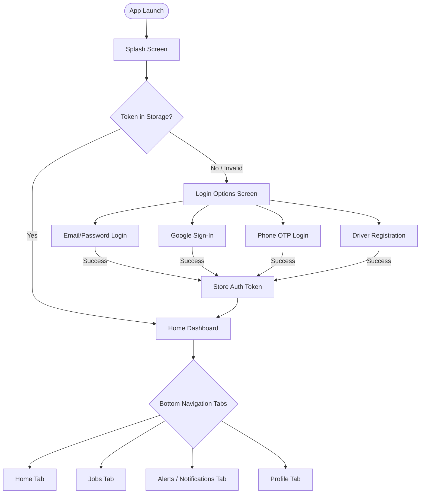
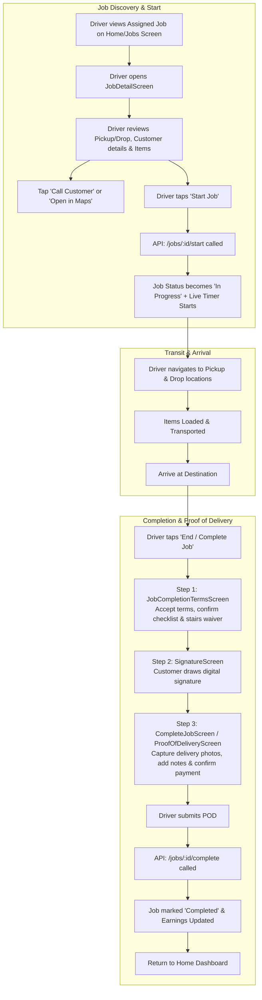
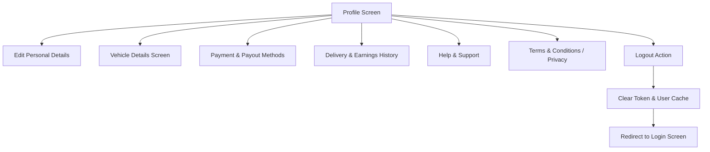

# DeliveryPlus Driver App - Features & User Flow Documentation

## 1. Overview (ऐप परिचय)
**DeliveryPlus Driver App** ek modern, feature-rich React Native mobile application hai jo drivers aur moving professionals ke liye banaya gaya hai. Ye app drivers ko delivery aur moving jobs receive karne, live tracking karne, customer se communicate karne, digital signature & photos ke through Proof of Delivery (POD) collect karne aur earnings track karne ki suvidha deta hai.

---

## 2. Core Features (मुख्य फीचर्स)

### 🔐 1. Authentication & Onboarding (लॉगिन एवं रजिस्ट्रेशन)
* **Multiple Login Options**:
  * **Email & Password Login**: Direct email aur password se authentication.
  * **Google Sign-In**: One-tap Google authentication (@react-native-google-signin).
  * **Phone OTP Login**: Mobile number daal kar OTP verification ke through login.
* **Driver Sign-Up**: Naye driver ke liye complete account creation form.
* **Auto-Login / Session Management**: `AsyncStorage` me secure auth token store hota hai aur app start hone par session auto-restore hota hai.
* **Auto Logout on Token Expiry**: 401 error aane par user ko safely login screen par redirect kiya jata hai.

---

### 🏠 2. Driver Dashboard / Home Screen (होम स्क्रीन)
* **Driver Status & Profile Header**: Driver ka naam, profile picture, aur status.
* **Online/Offline Shift Toggle**: Driver apni availability toggle kar sakta hai.
* **Live Job Timer Banner**: Agar koi job *In-Progress* hai, toh dashboard ke top par persistent live timer aur quick navigation link display hota hai.
* **Driver Performance Stats**:
  * Assigned / Today's Jobs count
  * In-Transit / Active count
  * Completed deliveries count
  * Today's / Total Earnings preview
* **Today's Jobs List**: Aaj ki delivery aur moving jobs ki interactive card list with status badges, customer name, addresses, and price.
* **Pull-to-Refresh**: Naye jobs aur updated stats load karne ke liye swipe-to-refresh.

---

### 📋 3. Jobs Management (जॉब लिस्टिंग एवं फिल्टर्स)
* **Tab-based Categorization**:
  * **All / Upcoming**: Assigned aur scheduled jobs.
  * **In Progress**: Active jobs jin par driver abhi kaam kar raha hai.
  * **Completed**: Successfully deliver ho chuki jobs.
  * **Cancelled**: Cancel hui jobs ka record.
* **Job Type Identification**: Clear visual indicators for **Delivery** vs **Moving** jobs.
* **Search & Filter**: Job number, customer name ya location ke hisab se filtering.

---

### 🔍 4. Job Details & Multi-Driver Execution (जॉब डिटेल एवं मल्टी-ड्राइवर टाइमिंग)
* **Comprehensive Job Information**:
  * Job Number, Job Type (Delivery / Moving), Scheduled Time & Date.
  * Pickup Address aur Dropoff Address with route distance.
  * Item Details / Inventory list (Moving jobs ke liye items list).
* **Multi-Driver Independent Timing Architecture**:
  * Ek hi job par multiple drivers (e.g. Shivam @ 09:00, Vikash @ 09:30, Garvita @ 10:00) ke liye **independent timers** aur **independent start/end timestamps**.
  * Naye driver ko pehle ke driver ka timer inherit NAHI hota.
  * *Job Status* badge aur *My Work Status* badge ka dual display.
  * *My Start Time*, *My End Time*, aur *My Live Job Time* banner.
* **Customer Interaction**:
  * One-tap direct phone call (`tel:`) to customer.
  * Customer notes & special delivery instructions.
* **One-Tap GPS Navigation**:
  * Apple Maps / Google Maps me pickup aur drop addresses open karne ki direct facility.
* **Job Action Controls**:
  * **Start Job**: Driver-specific agreement and signature verification ke baad start hota hai.
  * **Live Timer**: Real-time driver-scoped hours, minutes, seconds tracking.
  * **End / Complete Job**: Driver-specific completion workflow trigger karta hai.

---

### ✍️ 5. Proof of Delivery & Completion Flow (जॉब समाप्ति एवं POD)
1. **Terms & Completion Agreement (`JobCompletionTermsScreen`)**:
   * Delivery confirmation checklist.
   * Stairs / Property check waiver (agar stairs available hain toh waiver confirmation).
   * Customer aur driver ke naam ka confirmation.
2. **Digital Signature Canvas (`SignatureScreen`)**:
   * Interactive high-performance touch canvas (WebView-based).
   * Customer ka digital signature capture.
   * Clear canvas aur confirm buttons.
3. **Proof of Delivery & Photos (`ProofOfDeliveryScreen` / `CompleteJobScreen`)**:
   * Camera ya Gallery se delivery ke photos upload karna (e.g., delivered items, house door).
   * Delivery notes aur feedback add karna.
   * Payment confirmation (Cash collected / Online / Prepaid).
4. **Job Finalization**:
   * Backend API call to mark job as `completed` with timestamp, signature, and attachments.

---

### 💰 6. Earnings & Delivery History (कमाई एवं इतिहास)
* **Earnings Breakdown**: Daily, weekly aur monthly earning charts.
* **Trip / Job History**: Past completed deliveries ki detailed history with timestamps, payouts, and customer details.
* **Payout / Payment Methods (`PaymentMethodsScreen`)**: Bank account aur payout settings manage karne ka option.

---

### 👤 7. Profile & Vehicle Management (प्रोफाइल एवं वाहन प्रबंधन)
* **Driver Profile (`ProfileScreen`, `EditProfileScreen`)**:
  * Personal info update: Name, Phone, Email, Address, Profile Photo.
* **Vehicle Details (`VehicleDetailsScreen`)**:
  * Vehicle Type (Van, Truck, Pickup, etc.)
  * Model, Make, Registration / License Plate Number.
  * Vehicle capacity and documents.

---

### 🔔 8. Alerts & Notifications (`NotificationsScreen`)
* **Real-time Notifications**: New job assignments, status changes, admin announcements, aur payment alerts.
* **Unread Badge**: Bottom tab bar par dynamic unread notification badge counter.

---

### 🛡️ 9. Help, Legal & Support (सपोर्ट एवं नियम)
* **Help & Support (`HelpSupportScreen`)**: Contact support, FAQs, and ticket submission.
* **Terms of Service (`TermsScreen`)**: Legal guidelines and partner agreement.
* **Privacy Policy (`PrivacyScreen`)**: Data privacy and safety policies.

---

## 3. Application Architecture & Tech Stack (तकनीकी संरचना)

```
DeliveryPlusDriverApp
├── App.js                   # Root Component (SafeAreaProvider, StatusBar, AppNavigator)
├── src/
│   ├── navigation/
│   │   ├── AppNavigator.js  # Root Native Stack Navigator (Auth, Modals, Screens)
│   │   └── BottomTabs.js    # Bottom Tab Bar (Home, Jobs, Alerts, Profile)
│   ├── screens/             # 24 Screen Components
│   ├── services/
│   │   ├── api.js           # Axios Instance with Request/Response Interceptors & Auth Tokens
│   │   └── googleAuth.js    # Google Sign-In Service
│   ├── components/          # Reusable UI components, Headers, Timer Banners, Icons
│   ├── utils/               # Helper functions (jobHelpers, paymentProof, notifications)
│   └── theme/               # Colors, Typography & Layout Constants
```

---

## 4. End-to-End User Flow (फ्लो चार्ट्स)

### 🔹 Diagram 1: Overall Navigation & Authentication Flow



---

### 🔹 Diagram 2: Complete Job Lifecycle Flow (जॉब शुरू से डिलीवरी तक)



---

### 🔹 Diagram 3: Profile & Settings Flow



---

## 5. API Endpoints Reference Summary

| Module | HTTP Method | Endpoint | Purpose |
| :--- | :--- | :--- | :--- |
| **Auth** | `POST` | `/auth/login` | Email/password login |
| **Auth** | `POST` | `/auth/google` | Google sign-in validation |
| **Auth** | `POST` | `/auth/send-otp` & `/auth/verify-otp` | Phone OTP login |
| **Driver Profile** | `GET` | `/auth/me` | Fetch driver details & stats |
| **Driver Profile** | `PUT` | `/driver/profile` | Update profile / vehicle info |
| **Jobs** | `GET` | `/jobs/driver/my-jobs` | List driver's assigned jobs |
| **Jobs** | `GET` | `/jobs/:id` | Fetch specific job details |
| **Job Actions** | `POST` | `/jobs/:id/start` | Start job timer & transit |
| **Job Actions** | `POST` | `/jobs/:id/complete` | Finalize job with POD & signature |
| **Notifications** | `GET` | `/notifications` | Fetch driver alerts & announcements |
