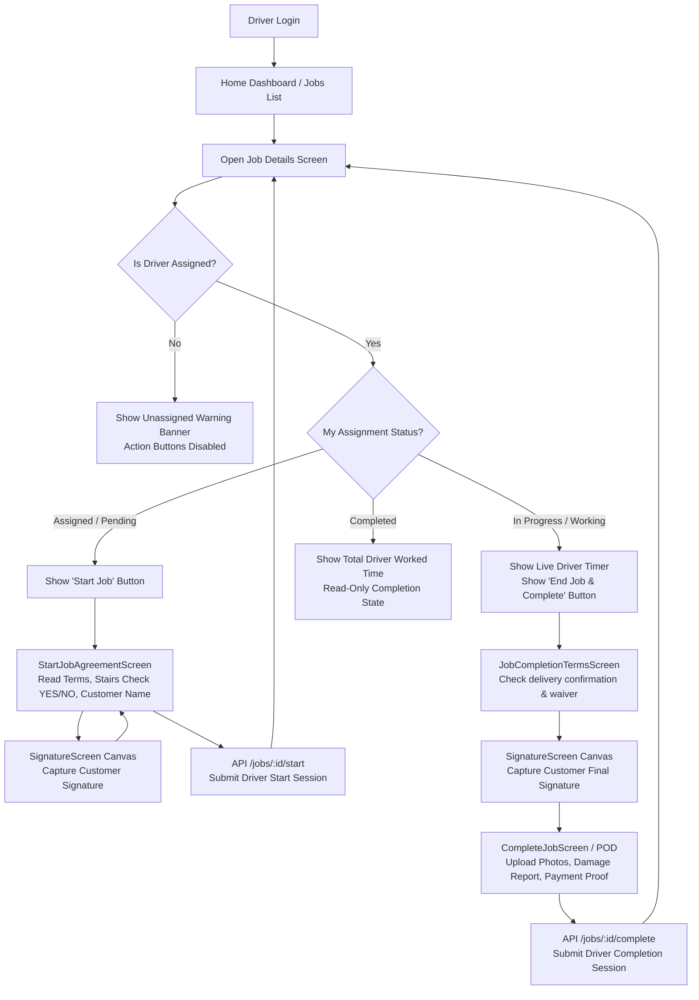

# DeliveryPlus Driver App - Complete Multi-Driver Flows & Architecture

> **Document Version:** 2.0  
> **Last Updated:** September 2026  
> **Target Audience:** Developers, Testers, Product Managers, Admins  

---

## 📌 1. Overview & Architecture Motivation (ज़रूरत और आर्किटेक्चर)

DeliveryPlus Driver App ek React Native mobile application hai jo **Moving** aur **Delivery** services ke liye use hota hai.

### ⚠️ Pehle ki Problem (Legacy Single-Driver Timing):
- Pehle app direct `job.startedAt` se live timer chalata tha.
- Agar ek job par 3 drivers assigned the, aur Driver 1 (Shivam) ne 09:00 baje start kiya, toh Driver 3 (Garvita) jo 10:00 baje aayi, usko bhi Shivam ka purana running timer (1 ghanta extra) inherit ho jata tha.
- Is wajah se billing, driver payouts, aur actual working hours galat record ho rahe the.

### ✅ Naya Solution (Multi-Driver Independent Timing Architecture):
- Har driver ka apna **independent work session** hota hai:
  - `assignedAt` (Driver kab assign hua)
  - `startedAt` (Driver ne actual kaam kab start kiya)
  - `completedAt` (Driver ne apna kaam kab khatam kiya)
  - `totalWorkedMinutes` (Driver ke actual working minutes)
  - `status` (Driver ka personal status: `assigned`, `working`/`in_progress`, `completed`)
  - `startAgreement` (Driver ke start karte waqt customer se liya gaya agreement/signature)
  - **Independent Live Timer** (Driver ka live elapsed timer strictly uske apne `startedAt` se chalta hai)
- Common Job Data (Customer details, Scheduled Date/Time, Pickup/Drop addresses, Items list) common rehta hai, jabki timing aur driver state driver-scoped hoti hai.

---

## 👥 2. Real-World Multi-Driver Scenario (उदाहरण)

```
========================================================================================
JOB REFERENCE: #JOB-7821 (3-Bedroom House Moving)
Scheduled Time: 09:00 AM - 01:00 PM
========================================================================================

1. Driver 1 (Shivam):
   - Assigned: 08:50 AM
   - Starts Work: 09:00 AM
   - Shivam's Live Timer: 09:00 AM se start hoga.
   - 09:30 AM par Shivam ka timer: "30 Min 00 Sec"

2. Driver 2 (Vikash):
   - Assigned: 08:50 AM
   - Starts Work: 09:30 AM
   - Vikash's Live Timer: 09:30 AM se start hoga.
   - 09:30 AM par Vikash ka timer: "00 Min 00 Sec" (Shivam ka 30 min inherit NAHI hua!)

3. Driver 3 (Garvita - Added later by Admin):
   - Assigned: 09:45 AM
   - Starts Work: 10:00 AM
   - Garvita's Live Timer: 10:00 AM se start hoga.
   - 10:00 AM par Garvita ka timer: "00 Min 00 Sec" (Zero se start hoga).

========================================================================================
RESULT: Teeno drivers ka payout aur actual worked time 100% accurate calculate hota hai.
========================================================================================
```

---

## 🔄 3. End-to-End User Screen Flows (स्क्रीन दर स्क्रीन फ्लो)



---

## 📱 4. Detailed Step-by-Step Screen Guide

### Flow 1: Job Details Screen (`JobDetailScreen.js`)
1. **Driver Identification**: App local storage (`getStoredUser()`) se logged-in driver ka ID nikalta hai.
2. **Assignment Normalization**: `normalizeMyDriverAssignment(job, currentUser)` call hota hai:
   - Backend ke `myAssignment`, `assignedDrivers`, `driverAssignments`, `workSessions`, ya `team` arrays ko search karta hai.
3. **Display Rules**:
   - **Header Badges**:
     - *Job Status Badge*: Overall job status (`Pending`, `In Progress`, `Completed`, `Cancelled`).
     - *My Work Badge*: Driver ka apna status (`My Work: Assigned`, `My Work: Working`, `My Work: Done`).
   - **Schedule & Work Time Card**:
     - *Scheduled Time*: Customer booking ka common scheduled time window.
     - *My Start Time*: Logged-in driver ka actual start time (`09:30 AM`).
     - *My End Time*: Logged-in driver ka actual end time (`01:15 PM`).
     - *Dynamic Bottom Banner*:
       - Running hone par: `My Live Job Time: 01 Hr 25 Min 14 Sec` (pulsing blue dot).
       - Complete hone par: `My Total Worked Time: 3 Hr 45 Min` (green checkmark).
       - Not started hone par: `Work not started` (gray hourglass).
       - Unassigned hone par: `You are not currently assigned to this job` (red warning).

---

### Flow 2: Start Job Flow (`StartJobAgreementScreen.js` + `SignatureScreen.js`)
1. Driver `JobDetailScreen` par **[Start Job]** button click karta hai.
2. `StartJobAgreementScreen` khulti hai:
   - Agreement box ko bottom tak scroll karna mandatory hai.
   - *Terms Accepted* checkbox tick karna hota hai.
   - *Stairs at Property* (YES / NO) select karna mandatory hai.
   - *Customer Name* enter hota hai.
3. Driver **[Capture Customer Signature]** click karta hai:
   - Screen `SignatureScreen` par navigate karti hai.
   - Customer finger ya stylus se signature draw karta hai.
   - **[Save Signature]** par click karte hi app `navigation.goBack()` use karta hai aur signature base64 state me pass karta hai.
   - **Important Fix**: Checkbox aur stairs selection reset **NAHI** hote.
4. Driver **[Confirm & Start Job]** click karta hai:
   - API call: `POST /jobs/:id/start` with payload:
     ```json
     {
       "startAgreement": {
         "termsRead": true,
         "termsAccepted": true,
         "stairsAtProperty": true,
         "stairsOption": "yes",
         "customerSignature": "data:image/png;base64,...",
         "customerSignatureName": "John Doe",
         "agreementVersion": "1.0"
       }
     }
     ```
   - Success alert aata hai, modal pop hota hai, aur `JobDetailScreen` par timer zero se run hona shuru ho jata hai.

---

### Flow 3: Live Timer & Background Sync
1. App `useElapsedTime(myAssignment.startedAt, isMyTimerRunning)` hook use karti hai.
2. Timer calculation formula:
   $$\text{elapsedSeconds} = \max\left(0, \left\lfloor \frac{\text{Date.now()} - \text{new Date}(\text{myAssignment.startedAt}).\text{getTime()}}{1000} \right\rfloor\right)$$
3. **Timer Benefits**:
   - Device band ya app close hone par bhi time miss nahi hota, kyunki time difference server timestamp (`startedAt`) se directly derive hota hai.
   - Doosre driver ka timer is driver ke timer se 100% alag rehta hai.

---

### Flow 4: Job Completion & POD Flow (`JobCompletionTermsScreen` -> `CompleteJobScreen`)
1. Driver **[End Job & Complete]** click karta hai.
2. Customer ka end signature capture hota hai.
3. Proof of Delivery Screen par:
   - Delivery photos upload hoti hain.
   - Damage declaration & damage photos add hoti hain (agar koi item break hua ho).
   - Payment method confirm hota hai (Cash collected, Card, Online).
4. API call `POST /jobs/:id/complete` hit hoti hai.
5. Driver ka session `completed` ho jata hai aur total duration calculate hokar freeze ho jati hai.

---

## 🛠️ 5. Key Code Files & Methods Reference

| File | Purpose | Key Methods / Exported Logic |
|---|---|---|
| [src/utils/jobHelpers.js](file:///Users/rajjeet/Documents/DeliveryPlusDriverApp-main/src/utils/jobHelpers.js) | Driver timing & job normalization engine | `normalizeMyDriverAssignment()`, `calculateDriverDuration()`, `useElapsedTime()`, `normalizeJob()`, `getDriverId()` |
| [src/screens/JobDetailScreen.js](file:///Users/rajjeet/Documents/DeliveryPlusDriverApp-main/src/screens/JobDetailScreen.js) | Main job view & timer screen | Displays Job vs Driver status, My Start/End time, Live Timer banner, action buttons |
| [src/screens/StartJobAgreementScreen.js](file:///Users/rajjeet/Documents/DeliveryPlusDriverApp-main/src/screens/StartJobAgreementScreen.js) | Pre-job terms & agreement verification | Checkbox state preservation, Stairs validation, Signature capture |
| [src/screens/SignatureScreen.js](file:///Users/rajjeet/Documents/DeliveryPlusDriverApp-main/src/screens/SignatureScreen.js) | Touch canvas for digital signatures | Clean base64 output, `goBack()` with callback to prevent layer-on-layer screen stacking |
| [src/screens/HomeScreen.js](file:///Users/rajjeet/Documents/DeliveryPlusDriverApp-main/src/screens/HomeScreen.js) | Dashboard with active job cards | Logged-in driver specific `JobTimerBanner` on cards |
| [src/screens/JobsScreen.js](file:///Users/rajjeet/Documents/DeliveryPlusDriverApp-main/src/screens/JobsScreen.js) | Filterable job listings | Scoped timer display for in-progress driver assignments |
| [src/services/api.js](file:///Users/rajjeet/Documents/DeliveryPlusDriverApp-main/src/services/api.js) | API client & auth session storage | `getCurrentUser()`, `getStoredUser()`, `setAuthToken()` |

---

## 🔒 6. Security & Edge Case Handling (सुरक्षा एवं एरर हैंडलिंग)

1. **Unassigned Driver Protection**:
   - Agar kisi driver ko job ka link ya notification mila lekin admin ne use unassign kar diya hai, toh app `isAssigned: false` mark karti hai.
   - Unassigned driver ke liye Start/Complete buttons render nahi honge.
2. **Session Persistence**:
   - Driver session aur user data `AsyncStorage` me cached rehta hai, jisse offline ya weak network me bhi screen blank nahi hoti.
3. **No Screen Stacking Bug**:
   - Signature screen se return hone par `navigation.navigate()` ki jagah `navigation.goBack()` aur callback pattern use kiya gaya hai jisse screens duplicate ya stack nahi hoti hain.
4. **Timezone Safe Formatting**:
   - Australian/Local dates aur ISO 8601 strings bina timezone offset distortion ke parse hoti hain.

---

## 🚀 7. Summary for Admin / Backend Integration
Backend ko response me ya toh:
- `job.myAssignment` (current requesting driver ka assignment object), ya
- `job.assignedDrivers` / `job.driverAssignments` array
me driver ka `startedAt`, `completedAt`, aur `totalWorkedMinutes` return karna hota hai. App automatically dono formats ko gracefully handle karti hai.
