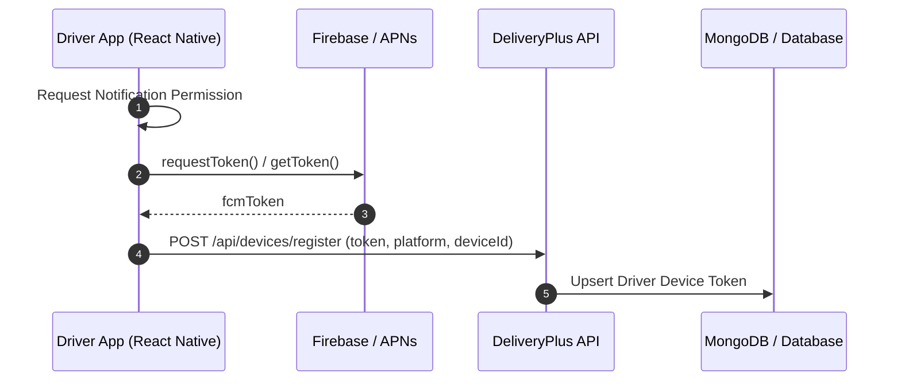

# Production Push Notification Audit Report
**Project:** DeliveryPlus Driver App  
**Platform:** React Native CLI (iOS & Android)  
**Date:** September 21, 2026  
**Auditor:** Antigravity AI Engineering  
**Scope:** Complete End-to-End Production Push Notification Architecture, Lifecycle States, Native Configurations, Token Management, and Event Dispatch.

---

## Executive Summary & Status Table

| Operating State | Android Status | iOS Status | Critical Gaps Identified |
| :--- | :--- | :--- | :--- |
| **Foreground Mode** | ❌ **FAIL** | ❌ **FAIL** | No FCM / Notifee SDK installed; no `messaging().onMessage` listener; no in-app local notification banner. |
| **Background Mode** | ❌ **FAIL** | ❌ **FAIL** | No background message handler in `index.js`; missing `google-services.json` on Android; missing AppDelegate Firebase configuration on iOS. |
| **Killed / Terminated Mode** | ❌ **FAIL** | ❌ **FAIL** | No `getInitialNotification()` cold-start handler; no navigation ready queue; no auth hydration safety check. |

---

## Section-by-Section Audit

### 1. Push Architecture Discovery

- **Installed Packages (`package.json`):**
  - `@react-native-firebase/app`: ❌ **NOT INSTALLED**
  - `@react-native-firebase/messaging`: ❌ **NOT INSTALLED**
  - `@notifee/react-native`: ❌ **NOT INSTALLED**
  - `react-native-push-notification`: ❌ **NOT INSTALLED**
  - `expo-notifications`: ❌ **NOT INSTALLED**
- **Native Entry Points (`index.js` & `App.js`):**
  - `index.js` only executes `AppRegistry.registerComponent`. No background message handler is registered.
  - `App.js` only mounts `SafeAreaProvider` and `AppNavigator`. No notification lifecycle provider, listener, or token registration logic exists.
- **In-App Notification Center (`src/screens/NotificationsScreen.js`):**
  - Renders hardcoded mock data (`initialNotifications`) stored in local component state.
  - Does not fetch remote notifications from the backend API.
- **Unread Badge (`src/navigation/BottomTabs.js` & `src/screens/HomeScreen.js`):**
  - `BottomTabs.js` uses static mock count from `notificationsData.js`.
  - `HomeScreen.js` has a placeholder call to `API.get("/notifications?limit=1")` but lacks full pagination, mark-as-read syncing, and push integration.

---

### 2. Android Configuration Audit

- **`google-services.json`:** ❌ **MISSING** from `android/app/`.
- **`android/build.gradle`:** ❌ Missing Google Services Gradle classpath (`classpath("com.google.gms:google-services:4.4.2")`).
- **`android/app/build.gradle`:** ❌ Missing Google Services plugin application (`apply plugin: "com.google.gms.google-services"`).
- **`AndroidManifest.xml`:**
  - Missing `<uses-permission android:name="android.permission.POST_NOTIFICATIONS" />` for Android 13+ (API 33+).
  - Missing `<uses-permission android:name="android.permission.VIBRATE" />`.
  - Missing default notification channel and icon metadata.
- **Runtime Permissions:** ❌ No Android 13+ `POST_NOTIFICATIONS` runtime prompt implemented.

---

### 3. iOS Configuration Audit

- **`GoogleService-Info.plist`:** ⚠️ Present in `ios/GoogleService-Info.plist` (Bundle ID: `com.deliveryplusdriverapp`, Project ID: `delivery-plus-driver`). A duplicate `GoogleService-Info (3).plist` is also present and should be cleaned up.
- **`Info.plist`:** ✅ `UIBackgroundModes` contains `fetch` and `remote-notification`.
- **Entitlements (`DeliveryPlusDriverAppRelease.entitlements`):** ✅ `aps-environment` is set to `development`.
- **`AppDelegate.swift`:**
  - ❌ Missing `FirebaseApp.configure()`.
  - ❌ Missing `UNUserNotificationCenterDelegate` implementation.
  - ❌ Missing `application(_:didRegisterForRemoteNotificationsWithDeviceToken:)` APNs token registration.

---

### 4. FCM Token Lifecycle Flow



- **Current Status:** ❌ **NOT IMPLEMENTED**.
- **Requirement:**
  - On app launch / login, request permission and fetch FCM token.
  - Register with backend via `POST /api/devices/register` with payload:
    ```json
    {
      "token": "eX_...fcmToken",
      "platform": "ios" | "android",
      "deviceId": "UUID-...",
      "appVersion": "1.0.0"
    }
    ```
  - Associate the token with the authenticated driver JWT.

---

### 5. Token Refresh & Stale Token Handling

- **Current Status:** ❌ **NOT IMPLEMENTED**.
- **Requirement:**
  - Register `messaging().onTokenRefresh(async (newToken) => { ... })`.
  - Automatically sync new token to the backend.
  - Prevent orphaned or dead tokens from remaining active in the database.

---

### 6. Logout Cleanup

- **Current Status:** ❌ **NOT IMPLEMENTED**.
- **Finding:** `clearAuthToken()` in `src/services/api.js` clears local AsyncStorage tokens (`@delivery_plus_driver_auth_token` and `@delivery_plus_driver_auth_user`), but does NOT notify the backend to deactivate the device's push token.
- **Risk:** If Driver A logs out on a shared phone and Driver B logs in, Driver B will receive Driver A's push notifications until the backend token is explicitly unregistered.
- **Requirement:** Call `POST /api/devices/unregister` (or `DELETE /api/devices/:token`) during logout before clearing auth tokens.

---

### 7. Multi-Device Driver Support

- **Current Status:** ❌ No token registry exists.
- **Architecture Requirement:** Backend schema must store an array of device tokens per driver (e.g. phone + tablet or dual phone) rather than a single scalar `fcmToken` string:
  ```json
  "deviceTokens": [
    {
      "token": "...",
      "platform": "android",
      "deviceId": "dev_123",
      "lastActiveAt": "2026-09-21T10:00:00Z"
    }
  ]
  ```

---

### 8. Foreground Mode Handling

- **Current Status:** ❌ **NOT IMPLEMENTED**.
- **Behavior:** When the app is foregrounded, FCM messages do not trigger default system alerts on Android/iOS.
- **Requirement:**
  - Listen via `messaging().onMessage(async (remoteMessage) => { ... })`.
  - Display a styled in-app floating banner or local notification via `@notifee/react-native`.
  - Play sound and vibration without duplicating alerts.

---

### 9. Foreground Notification Popup & In-App UI

- **Format:** Custom banner showing:
  - **Title:** e.g., *"New Job Assigned"*
  - **Body:** e.g., *"JOB01 — Connaught Place → Gurgaon"*
  - **Action:** Tap to navigate directly to `JobDetailScreen(jobId)`.

---

### 10. Background Mode Handling

- **Current Status:** ❌ **NOT IMPLEMENTED**.
- **Requirement:**
  - When minimized, the OS system notification tray displays the incoming job alert.
  - User tapping the notification tray item triggers `messaging().onNotificationOpenedApp((remoteMessage) => { ... })`.
  - App navigates to `JobDetailScreen` with the corresponding `jobId`.

---

### 11. Killed / Terminated (Cold Start) Mode Handling

- **Current Status:** ❌ **NOT IMPLEMENTED**.
- **Critical Flow:**
  1. Driver swipes away / force-closes app.
  2. Dispatcher assigns a job → FCM push arrives in OS notification tray.
  3. Driver taps notification → OS cold-starts the app.
  4. App must call `messaging().getInitialNotification()`.
  5. If `remoteMessage` exists, parse `jobId` and store in pending navigation queue.
  6. Wait until `NavigationContainer` is ready and Auth session is restored from `AsyncStorage`.
  7. Navigate safely to `JobDetailScreen({ jobId })`.

---

### 12. Background Message Handler

- **Current Status:** ❌ **NOT IMPLEMENTED**.
- **Requirement:** In `index.js` (before `AppRegistry.registerComponent`):
  ```javascript
  import messaging from '@react-native-firebase/messaging';

  messaging().setBackgroundMessageHandler(async (remoteMessage) => {
    console.log('[FCM] Background message received:', remoteMessage.messageId);
  });
  ```

---

### 13. Notification Tap & Deep Linking Schema

```json
{
  "type": "NEW_JOB_ASSIGNED",
  "notificationId": "notif_67890",
  "jobId": "65b8c1d3f9e4a10012ab34cd",
  "jobNumber": "JOB-1042",
  "title": "New Job Assigned",
  "body": "You have been assigned to Job #JOB-1042",
  "timestamp": "2026-09-21T12:00:00Z"
}
```

- Navigation Resolver:
  - If `type === "NEW_JOB_ASSIGNED"` | `"JOB_UPDATED"` | `"JOB_CANCELLED"`: Navigate to `JobDetailScreen` passing `{ jobId, id: jobId }`.
  - If `type === "PAYMENT_RECEIVED"`: Navigate to `PaymentMethodsScreen` / Earnings.

---

### 14. Navigation Not Ready Guard (Race Condition Prevention)

- **Issue:** Cold-start notifications resolve before React Navigation finishes mounting.
- **Solution:** Navigation service with `isReadyRef` and `pendingNavigationTarget`:
  ```javascript
  let isNavReady = false;
  let pendingTarget = null;

  export const setNavigationReady = (ready) => {
    isNavReady = ready;
    if (ready && pendingTarget) {
      navigate(pendingTarget.name, pendingTarget.params);
      pendingTarget = null;
    }
  };
  ```

---

### 15. Auth Hydration Guard

- **Issue:** Cold-start from notification fires before `getStoredAuthToken()` resolves.
- **Solution:**
  - If token exists and is valid: Proceed to `JobDetailScreen`.
  - If token is expired / driver logged out: Redirect to `LoginScreen`, saving target destination in navigation state for post-login redirect.

---

### 16. Required Job Event Notifications Matrix

| Event Type | Target Driver(s) | Foreground Popup | Background / Tray | Sound / Priority |
| :--- | :--- | :--- | :--- | :--- |
| `NEW_JOB_ASSIGNED` | Newly assigned driver | Banner + Sound | System Tray | High / Max |
| `ADDITIONAL_DRIVER_ASSIGNED` | Only the added driver | Banner + Sound | System Tray | High / Max |
| `JOB_UPDATED` | All active assigned drivers | Banner | System Tray | Default |
| `SCHEDULE_CHANGED` | All active assigned drivers | Banner + Sound | System Tray | High |
| `JOB_CANCELLED` | All assigned drivers | Banner + Alert | System Tray | High / Alert |
| `DRIVER_REMOVED_FROM_JOB` | Only the removed driver | Banner | System Tray | High |
| `JOB_REMINDER` | Assigned driver(s) | Banner | System Tray | Default |

---

### 17. Multi-Driver Assignment Targeting Logic

- **Problem:** When an additional helper driver (e.g. Vikash) is assigned to `JOB01` after Shivam was already assigned, Shivam should NOT receive another "New Job Assigned" notification.
- **Requirement:** Backend assignment worker must diff previous `assignedDriverIds` vs new `assignedDriverIds`, targeting `NEW_JOB_ASSIGNED` strictly to `newDriverIds = newAssigned - previousAssigned`.

---

### 18. Removed Driver Handling

- When a driver is removed from a job, send a one-time `DRIVER_REMOVED_FROM_JOB` notification.
- Immediately purge that driver ID from future notification recipient lists for that job.

---

### 19. Payload Standardization

- Always use structured `data` keys (`jobId`, `type`, `jobNumber`).
- Never rely on regex parsing of visible `notification.body` or `notification.title`.

---

### 20. Android Notification Channels

Create distinct channels on Android app launch:
1. `jobs_urgent` (Importance: `HIGH`, Sound: `custom_alert.mp3`, Vibration: `true`)
2. `job_updates` (Importance: `DEFAULT`, Sound: `default`)
3. `general_info` (Importance: `LOW`)

---

### 21. Android 13+ Runtime Permissions

- Check API level: If `Platform.OS === 'android' && Platform.Version >= 33`, invoke:
  `PermissionsAndroid.request(PermissionsAndroid.PERMISSIONS.POST_NOTIFICATIONS)`.

---

### 22. iOS APNs Permission Handling

- Request authorization via:
  `const authStatus = await messaging().requestPermission();`
- Handle `AUTHORIZED`, `PROVISIONAL`, `DENIED`, and `NOT_DETERMINED` without crashing.

---

### 23. Sound, Vibration & Badge Behavior

- Prevent duplicate sounds when receiving data payloads in foreground.
- Sync application icon badge count with backend unread notification count.

---

### 24. Duplicate Push Prevention

- Use a single strategy: Send **Notification + Data** payload from backend with standard FCM fields:
  ```json
  {
    "notification": { "title": "...", "body": "..." },
    "data": { "jobId": "...", "type": "NEW_JOB_ASSIGNED" }
  }
  ```
- Android/iOS system will automatically display tray notifications in Background & Killed states.
- The app's `onMessage` handler will only render an in-app banner in **Foreground** mode, preventing double popups.

---

### 25. In-App Notification Center Sync

- Update [NotificationsScreen.js](file:///Users/rajjeet/Documents/DeliveryPlusDriverApp-main/src/screens/NotificationsScreen.js) to:
  1. Fetch list from `GET /api/notifications`.
  2. Implement pull-to-refresh.
  3. Support "Mark as read" (`PATCH /api/notifications/:id/read`).
  4. Support "Mark all as read" (`PATCH /api/notifications/read-all`).

---

### 26. Fail-Safe Backend Dispatch

- Push notification dispatch in CRM / Backend controllers must be wrapped in `try/catch` and executed asynchronously (e.g. background queue / worker) so that push delivery failures never block database commits or job status transitions.

---

## Comprehensive Implementation Plan & Checklist

### Phase 1: Dependency Installation & Native Linking
- [ ] Install `@react-native-firebase/app` and `@react-native-firebase/messaging`.
- [ ] Install `@notifee/react-native` for high-fidelity foreground banner display and channel management.
- [ ] Run `cd ios && pod install`.

### Phase 2: Android Native Configuration
- [ ] Add `google-services.json` to `android/app/`.
- [ ] Add `classpath("com.google.gms:google-services:4.4.2")` in `android/build.gradle`.
- [ ] Add `apply plugin: "com.google.gms.google-services"` in `android/app/build.gradle`.
- [ ] Add `POST_NOTIFICATIONS` permission in `AndroidManifest.xml`.

### Phase 3: iOS Native Configuration
- [ ] Configure `FirebaseApp.configure()` in `AppDelegate.swift`.
- [ ] Set up `UNUserNotificationCenter` and register for remote notifications.
- [ ] Verify APNs Auth Key (`.p8`) configured in Firebase Console.

### Phase 4: JS Notification Service & Handlers
- [ ] Create `src/services/notificationService.js` implementing:
  - Permission requests (Android 13+ & iOS).
  - Token retrieval & backend registration.
  - Token refresh listener (`onTokenRefresh`).
  - Foreground message handler (`onMessage`).
  - Background open listener (`onNotificationOpenedApp`).
  - Cold-start initial notification handler (`getInitialNotification`).
  - Notification channel creation.
- [ ] Register `setBackgroundMessageHandler` in `index.js`.
- [ ] Attach `notificationService.init()` and navigation listeners in `App.js` / `AppNavigator.js`.
- [ ] Integrate device unregistration in `clearAuthToken()` on logout.

### Phase 5: Notification Center Backend Integration
- [ ] Connect `NotificationsScreen.js` to real backend endpoints (`/notifications`).
- [ ] Synchronize badge unread count across `BottomTabs.js` and `HomeScreen.js`.

---

## Manual Test Verification Matrix (Physical Devices)

| Test Case | State | Action | Expected Result |
| :--- | :--- | :--- | :--- |
| **TEST-A** | Android Foreground | Dispatch job assignment | In-app banner appears immediately; tapping opens `JobDetailScreen`. |
| **TEST-B** | Android Background | Dispatch job assignment | System notification tray displays alert; tapping launches app & opens `JobDetailScreen`. |
| **TEST-C** | Android Killed | Dispatch job assignment | System tray alert arrives; tapping triggers cold start, restores session, and opens `JobDetailScreen`. |
| **TEST-D** | iOS Foreground | Dispatch job assignment | In-app banner appears; tap navigates to `JobDetailScreen`. |
| **TEST-E** | iOS Background | Dispatch job assignment | APNs banner arrives; tap opens app to `JobDetailScreen`. |
| **TEST-F** | iOS Killed | Dispatch job assignment | APNs banner arrives; tap cold-starts app directly into `JobDetailScreen`. |
| **TEST-G** | Multi-driver Add | Add Driver B to active job | Driver B receives notification; Driver A receives no duplicate. |
| **TEST-H** | Logout Safety | Driver A logs out, Driver B logs in | Driver A's notifications are no longer delivered to the device. |
| **TEST-I** | Token Refresh | Invalidate / refresh token | Updated token is registered on backend automatically. |
